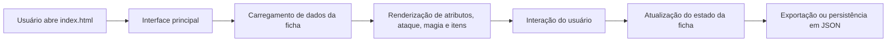

# Arquitetura do Sistema

## Visão geral

O projeto Ficha D&D é uma aplicação web front-end estática, voltada para a criação e gerenciamento de fichas de personagem para D&D 5e. A arquitetura atual combina interface, regras de negócio e persistência em um conjunto de páginas HTML, arquivos CSS e módulos JavaScript.

## Estrutura funcional

```text
FichaDnD/
├── index.html
├── README.md
├── ROADMAP.md
├── DECISOES_DE_ARQUITETURA.md
├── css/
├── assets/
├── js/
│   ├── main.js
│   ├── core/
│   ├── data/
│   ├── modules/
│   ├── CharacteristicRenderer.js
│   ├── CharacteristicStorage.js
│   ├── CharacteristicSystem.js
│   └── CharacteristicSystemIntegration.js
├── ficha/
│   ├── Ficha_DnD_-_Tatagiba_1.0.html
│   ├── Classes/
│   └── Personagens Ficha/
├── docs/
└── agentes/
```

## Camadas principais

### 1. Camada de apresentação

Responsável pela HTML, CSS e interações visuais. A tela principal é composta por abas, modais, cards e formulários de edição. O estilo temático reforça a identidade medieval e de pergaminho.

### 2. Camada de domínio

A lógica de regras do jogo está espalhada em módulos JavaScript. Isso inclui:

- atributos e modificadores
- bônus de proficiência
- combate e ataque
- dano e iniciativa
- magia e níveis de conjuração
- talentos e classe
- itens e equipamentos

### 3. Camada de dados

Os dados de jogo ficam em arquivos de configuração e em JSON de fichas.

- `js/data/` — regras e conteúdos do sistema
- `ficha/Classes/` — dados de classes e subclasses
- `ficha/Personagens Ficha/` — personagens salvos em JSON

### 4. Camada de persistência

A persistência é feita principalmente por exportação/importação em JSON e por compatibilidade com objetos em memória e campos de formulário.

## Fluxo principal



## Mecanismos de ciclo de vida

- O documento HTML é carregado no navegador
- Scripts de inicialização vinculam eventos e listeners
- Dados são renderizados em elementos HTML
- Ações do usuário disparam atualizações no estado e no DOM
- A ficha pode ser salva em JSON para persistência externa

## Padrões atuais e limitações

### Padrões ativos

- Separação funcional por módulos
- Estrutura de dados em arquivos JSON
- Persistência em arquivo e compatibilidade de dados legados
- UI orientada a formulários e modais

### Limitações

- Alto acoplamento com o DOM
- Uso de estado global e funções globais
- Dependência de IDs fixos em elementos HTML
- Menor testabilidade de lógica de negócio
- Complexidade crescente à medida que o projeto evolui

## Rumo da arquitetura

O projeto deve evoluir para uma estrutura mais modular e previsível, com:

- domínio separado da camada visual
- módulo de estado e persistência mais explícito
- funções centralizadas por responsabilidade
- rastreio mais simples de regressões de regras

## Conclusão

A arquitetura atual atende bem ao objetivo funcional de suporte à mesa, mas exige disciplina para evoluir sem gerar regressões. A próxima etapa ideal é reestruturar os módulos de domínio e reduzir o uso de variáveis globais.
